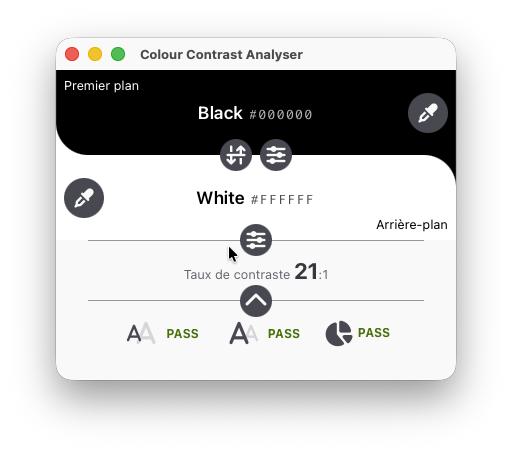

<div align="center">

# Colour Contrast Analyser


**Déterminez la lisibilité du texte et le contraste des éléments visuels, tels que les contrôles graphiques et les indicateurs visuels.**

[](https://github.com/WebAccessibilityTools/CCA/releases)
[](LICENSE)
[](https://tauri.app/)
[](https://www.rust-lang.org/)

*Read this in other languages: [English](README.md) | [Français](README.fr.md)*

</div>

---

Ce dépôt contient le code source de la nouvelle version du Colour Contrast Analyser (CCA) pour Windows et macOS.
Il s'agit d'une réécriture complète en Rust basée sur [Tauri](https://tauri.app/).

<div align="center">



</div>

## ❤️ Soutenir ce projet

Ce projet est développé principalement sur mon temps libre, porté par la
conviction que les outils d'accessibilité doivent être ouverts et
accessibles à tous. Pour qu'il reste fiable et facile à installer, j'ai
besoin de certificats de signature de code pour Windows et macOS — ce qui
représente un coût annuel réel. Si cet outil vous fait gagner du temps ou
aide votre équipe à livrer des produits plus accessibles, pensez à
sponsoriser ce projet. Même une petite contribution aide à le garder signé,
maintenu et gratuit.

[](https://github.com/sponsors/WebAccessibilityTools)

Ou, si vous préférez, offrez-moi un café pour m'aider à améliorer cet outil encore davantage.

<a href="https://www.buymeacoffee.com/ctrevisan" target="_blank"></a>

## Table des matières

- [Fonctionnalités](#fonctionnalités)
- [Installation (macOS)](#installation-macos)
- [Contribuer](#contribuer)
- [Contact](#contact)
- [Licence](#licence)

## Fonctionnalités

### Bêta 1

| Fonctionnalité | Statut |
|---|:---:|
| Accessibilité | En cours |
| Pipette de couleur native (Rust) | Fait |
| Mode pipette continu | Fait |
| Internationalisation (i18n) | Fait |
| Mode clair/sombre | Fait |
| Raccourcis pipette configurables | Fait |
| Curseurs RGB | Fait |
| Modèles de copier/coller | Fait |
| Nom de la couleur | Fait |

### Bêta 2

| Fonctionnalité | Statut |
|---|:---:|
| Composante alpha | Prévu |
| Valeurs de couleur HCL | Prévu |
| Valeurs de couleur HSV | Prévu |
| Valeurs de couleur LAB | Prévu |
| Valeurs de couleur LCHab | Prévu |
| Valeurs de couleur CMJN | Prévu |
| Saisie libre | Prévu |
| Installeur Windows/macOS | Prévu |
| Mise à jour automatique | Prévu |
| Certificats signés | Prévu |

### Futur

| Fonctionnalité | Statut |
|---|:---:|
| Version Linux | Prévu |
| Mode réduit/barre de menus | Prévu |
| Simulateur de daltonisme | Prévu |

## Installation (macOS)

> [!NOTE]
> L'application n'est pas encore signée avec un certificat Apple Developer. Vous devrez contourner Gatekeeper en utilisant l'une des options ci-dessous.

### Option 1 &mdash; Désactiver Gatekeeper (recommandé)

1. Téléchargez la dernière version depuis la page [Releases](https://github.com/WebAccessibilityTools/CCA/releases).
2. Déplacez le fichier `CCA.app` décompressé dans votre dossier **Applications**. **Ne double-cliquez pas encore.**
3. Ouvrez le **Terminal** et exécutez :
   ```shell
   sudo spctl --master-disable
   ```
4. Allez dans **Réglages du système** > **Confidentialité et sécurité** > **Sécurité** et choisissez **N'importe où**.
5. Double-cliquez sur `CCA.app` pour le lancer. Acceptez l'invite si demandé.

### Option 2 &mdash; Sans désactiver Gatekeeper

1. Téléchargez la dernière version depuis la page [Releases](https://github.com/WebAccessibilityTools/CCA/releases).
2. Activez **Réglages du système** > **Confidentialité et sécurité** > **Sécurité** > **App Store et développeurs identifiés**.
3. Double-cliquez sur `CCA.app`. Il sera bloqué. 
4. Allez dans **Réglages du système** > **Confidentialité et sécurité** > **Sécurité** et cliquez sur **Ouvrir quand même**.
5. Si demandé, autorisez l'exécution de l'application.

### Option 3 &mdash; Supprimer la quarantaine pour CCA uniquement

1. Téléchargez la dernière version depuis la page [Releases](https://github.com/WebAccessibilityTools/CCA/releases).
2. Déplacez le fichier `CCA.app` décompressé dans votre dossier **Applications**. **Ne double-cliquez pas encore.**
3. Ouvrez le **Terminal** et exécutez :
   ```shell
   sudo xattr -cr ~/Applications/CCA.app
   ```

## Contribuer

Si vous avez une idée de nouvelle fonctionnalité ou si vous avez trouvé un bug, veuillez [ouvrir un ticket](https://github.com/WebAccessibilityTools/CCA/issues). Recherchez d'abord les issues existantes pour éviter les doublons.

Les pull requests sont les bienvenues ! Veuillez suivre les [directives de contribution](CONTRIBUTING.md) avant de soumettre.

## Contact

Si vous avez des questions, n'hésitez pas à [ouvrir un ticket](https://github.com/WebAccessibilityTools/CCA/issues) ici sur GitHub.

## Licence

[](http://www.gnu.org/licenses/gpl-3.0.fr.html)

Colour Contrast Analyser (CCA) est un Logiciel Libre : vous pouvez l'utiliser, l'étudier, le partager et l'améliorer à votre guise. Plus précisément, vous pouvez le redistribuer et/ou le modifier selon les termes de la [Licence Publique Générale GNU](https://www.gnu.org/licenses/gpl.html) telle que publiée par la Free Software Foundation, soit la version 3 de la Licence, soit (à votre choix) toute version ultérieure.

> Ce programme est distribué dans l'espoir qu'il sera utile, mais **SANS AUCUNE GARANTIE** ; sans même la garantie implicite de **QUALITÉ MARCHANDE** ou d'**ADÉQUATION À UN USAGE PARTICULIER**. Voir la [Licence Publique Générale GNU](https://www.gnu.org/licenses/gpl.html) pour plus de détails.
