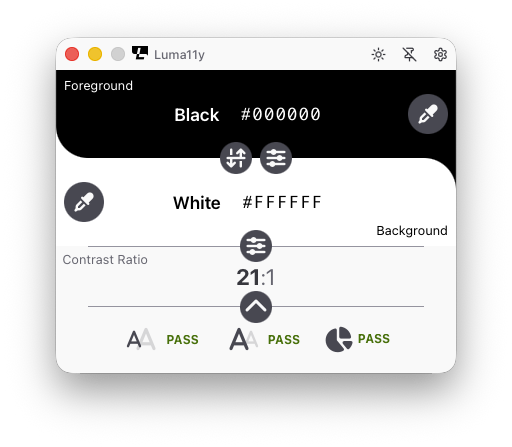

<div align="center">

# Luma11y


**Zistite čitateľnosť textu a kontrast vizuálnych prvkov, ako sú grafické ovládacie prvky a vizuálne indikátory.**

[](https://github.com/WebAccessibilityTools/Luma11y/releases)
[](LICENSE)
[](https://tauri.app/)
[](https://www.rust-lang.org/)

*Read this in other languages: [English](README.md) | [Français](README.fr.md) | [Slovenčina](README.sk.md)*

Slovenský preklad: **Radoslav Ďurač** ([@rraddatch](https://github.com/rraddatch))

</div>

---

Tento repozitár obsahuje zdrojový kód aplikácie Luma11y, nástroja na analýzu farebného kontrastu pre Windows a macOS.
Vytvorené v Rust a [Tauri](https://tauri.app/).

<div align="center">



</div>

## ❤️ Podporte tento projekt

Tento projekt vytváram výhradne vo svojom voľnom čase, poháňaný
presvedčením, že nástroje pre prístupnosť by mali byť otvorené a
dostupné pre všetkých. Aby zostal dôveryhodný a jednoducho inštalovateľný,
potrebujem certifikáty na podpisovanie kódu pre Windows aj macOS — čo so
sebou nesie reálne ročné náklady. Ak vám tento nástroj šetrí čas alebo
pomáha vášmu tímu vytvárať prístupnejšie produkty, zvážte sponzorovanie
tohto projektu. Aj malý príspevok výrazne pomôže udržať ho podpísaný,
udržiavaný a bezplatný.

[](https://github.com/sponsors/WebAccessibilityTools)

Alebo, ak preferujete, kúpte mi kávu na ďalšie vylepšovanie tohto nástroja.

<a href="https://www.buymeacoffee.com/ctrevisan" target="_blank"></a>

## Obsah

- [Funkcie](#funkcie)
- [Inštalácia (macOS)](#inštalácia-macos)
- [Prispievanie](#prispievanie)
- [Kontakt](#kontakt)
- [Licencia](#licencia)

## Funkcie

### Pre Betu 2

| Funkcia | Stav |
|---|:---:|
| Prístupnosť | Prebieha |
| Alfa farebná zložka | Plánované |
| Nové formáty farieb | hotovo |
| Voľné zadávanie textu | Hotovo |
| Inštalátor pre Windows/macOS | Plánované |
| Automatická aktualizácia | Plánované |
| Podpísané certifikáty | Plánované |

### Budúcnosť

| Funkcia | Stav |
|---|:---:|
| Verzia pre Linux | Plánované |
| Zjednodušený režim / panel menu | Plánované |
| Simulátor farbosleposti | Plánované |

## Inštalácia (macOS)

> [!NOTE]
> Aplikácia zatiaľ nie je podpísaná certifikátom Apple Developer. Budete musieť obísť Gatekeeper pomocou jednej z možností nižšie.

### Možnosť 1 &mdash; Vypnúť Gatekeeper (odporúčané)

1. Stiahnite si najnovšiu verziu zo stránky [Releases](https://github.com/WebAccessibilityTools/Luma11y/releases).
2. Presuňte rozbalený súbor `Luma11y.app` do priečinka **Aplikácie**. **Ešte naň dvakrát neklikajte.**
3. Otvorte **Terminál** a spustite:
   ```shell
   sudo spctl --master-disable
   ```
4. Prejdite do **Nastavenia systému** > **Súkromie a bezpečnosť** > **Bezpečnosť** a zvoľte **Kdekoľvek**.
5. Dvojklikom spustite `Luma11y.app`. Ak sa zobrazí výzva, potvrďte ju.

### Možnosť 2 &mdash; Bez vypnutia Gatekeeper

1. Stiahnite si najnovšiu verziu zo stránky [Releases](https://github.com/WebAccessibilityTools/Luma11y/releases).
2. Povoľte **Nastavenia systému** > **Súkromie a bezpečnosť** > **Bezpečnosť** > **App Store a overení vývojári**.
3. Dvojklikom spustite `Luma11y.app`. Bude zablokovaná.
4. Prejdite do **Nastavenia systému** > **Súkromie a bezpečnosť** > **Bezpečnosť** a kliknite na **Otvoriť napriek tomu**.
5. Ak sa zobrazí výzva, povoľte spustenie aplikácie.

### Možnosť 3 &mdash; Odstrániť karanténu iba pre Luma11y

1. Stiahnite si najnovšiu verziu zo stránky [Releases](https://github.com/WebAccessibilityTools/Luma11y/releases).
2. Presuňte rozbalený súbor `Luma11y.app` do priečinka **Aplikácie**. **Ešte naň dvakrát neklikajte.**
3. Otvorte **Terminál** a spustite:
   ```shell
   sudo xattr -cr ~/Applications/Luma11y.app
   ```

## Prispievanie

Ak máte nápad na novú funkciu alebo ste našli chybu, [otvorte issue](https://github.com/WebAccessibilityTools/Luma11y/issues). Najprv prehľadajte existujúce issues, aby ste predišli duplicitám.

Pull requesty sú vítané! Pred odoslaním si prosím prečítajte [Pravidlá pre prispievateľov](CONTRIBUTING.md).

## Kontakt

Ak máte akékoľvek otázky, neváhajte [otvoriť issue](https://github.com/WebAccessibilityTools/Luma11y/issues) tu na GitHube.

## Licencia

[](http://www.gnu.org/licenses/gpl-3.0.en.html)

Luma11y je slobodný softvér: môžete ho podľa vlastného uváženia používať, skúmať, zdieľať a vylepšovať. Konkrétne ho môžete ďalej šíriť a/alebo upravovať za podmienok [GNU General Public License](https://www.gnu.org/licenses/gpl.html) tak, ako ju zverejnila Free Software Foundation, buď vo verzii 3 tejto licencie, alebo (podľa vášho výberu) v ktorejkoľvek neskoršej verzii.

> Tento program je šírený v nádeji, že bude užitočný, avšak **BEZ AKEJKOĽVEK ZÁRUKY**; dokonca aj bez implicitnej záruky **PREDAJNOSTI** alebo **VHODNOSTI NA KONKRÉTNY ÚČEL**. Podrobnosti nájdete v [GNU General Public License](https://www.gnu.org/licenses/gpl.html).
